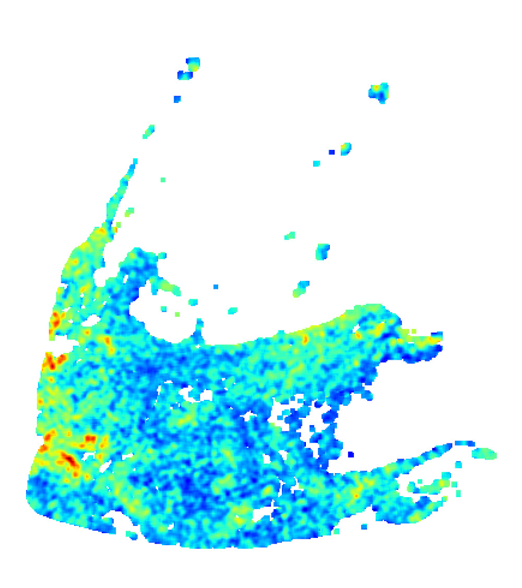
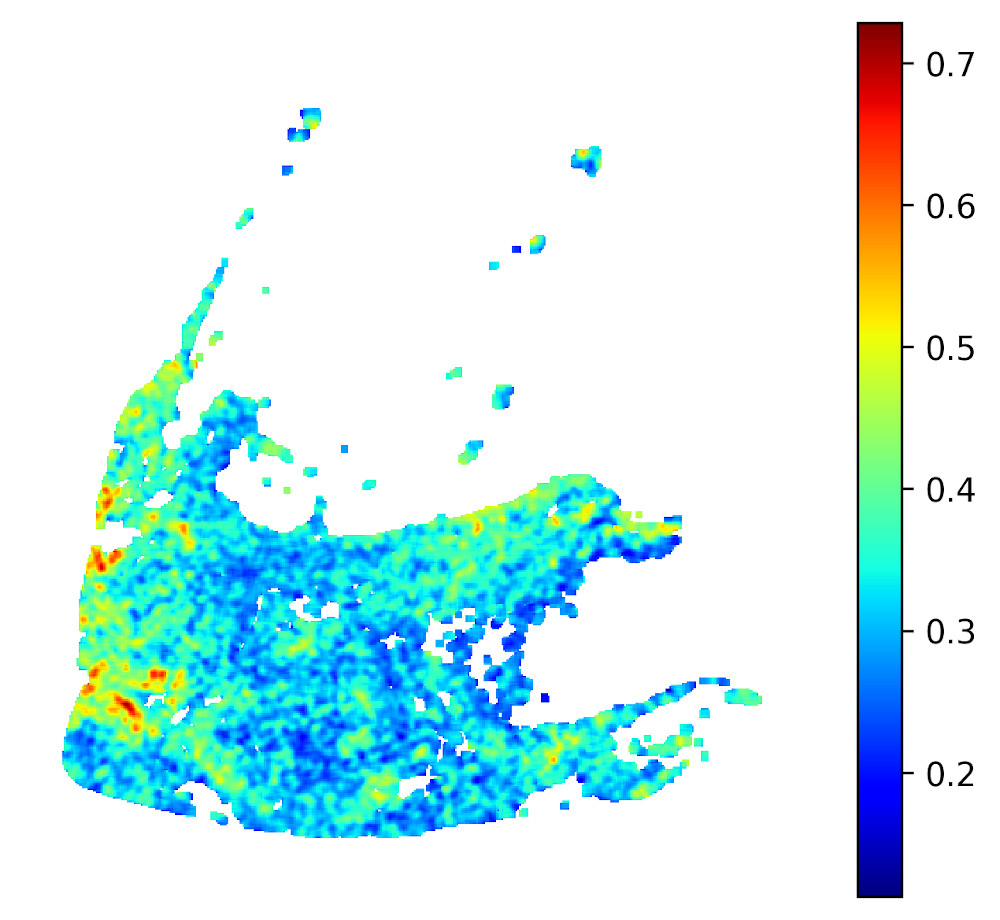
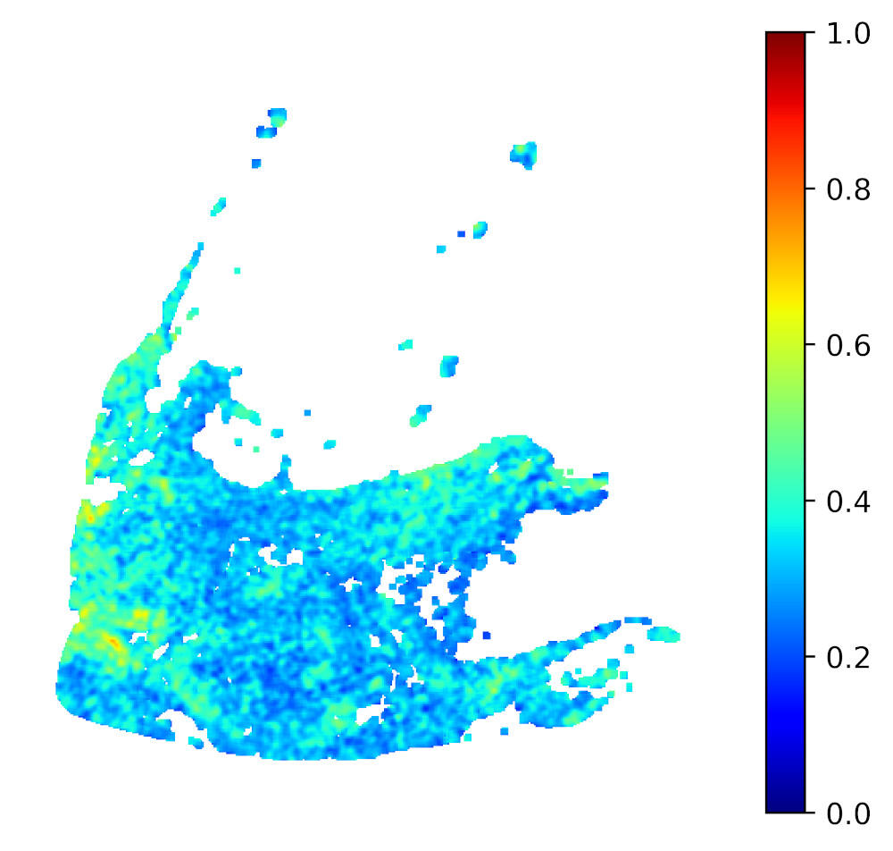
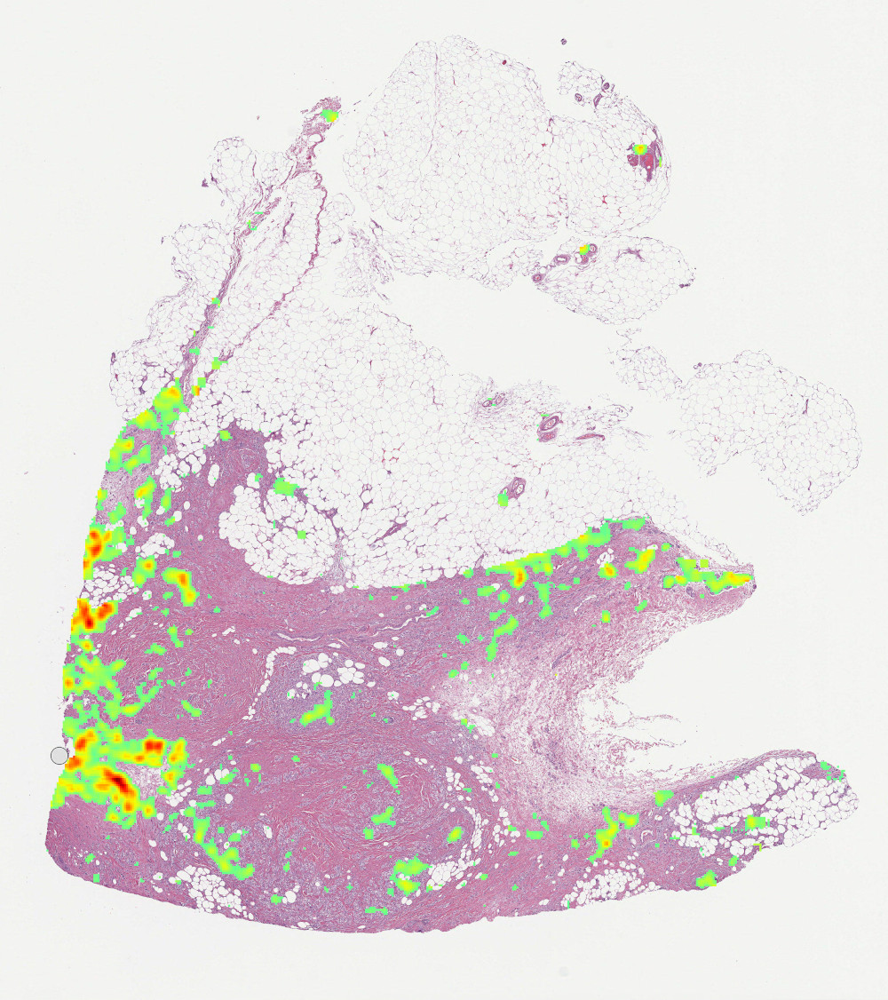
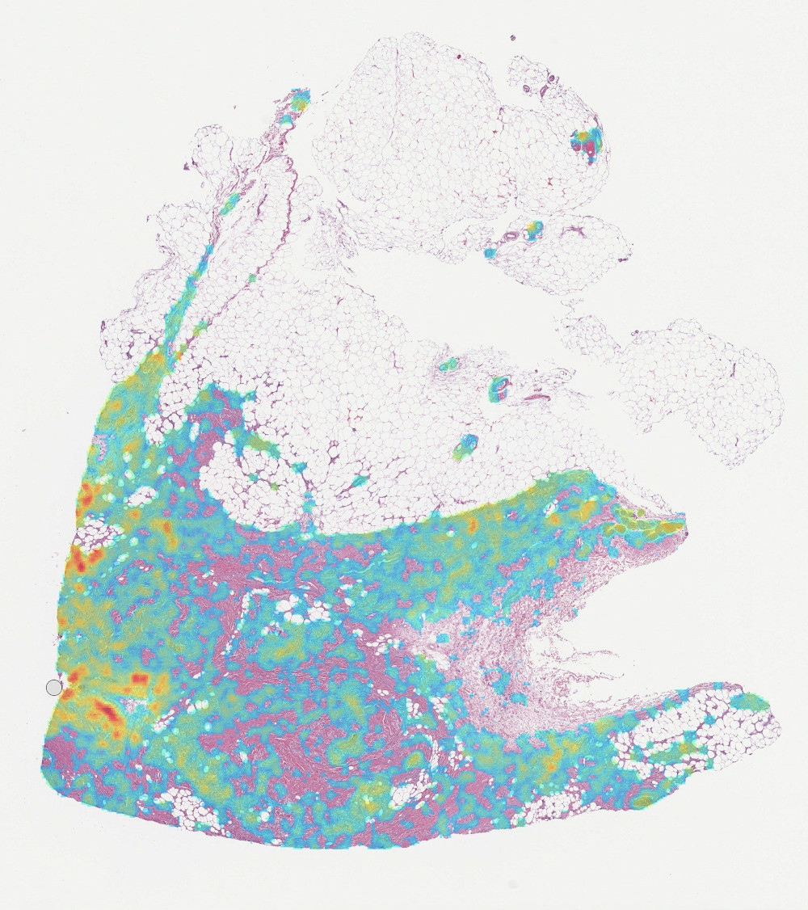
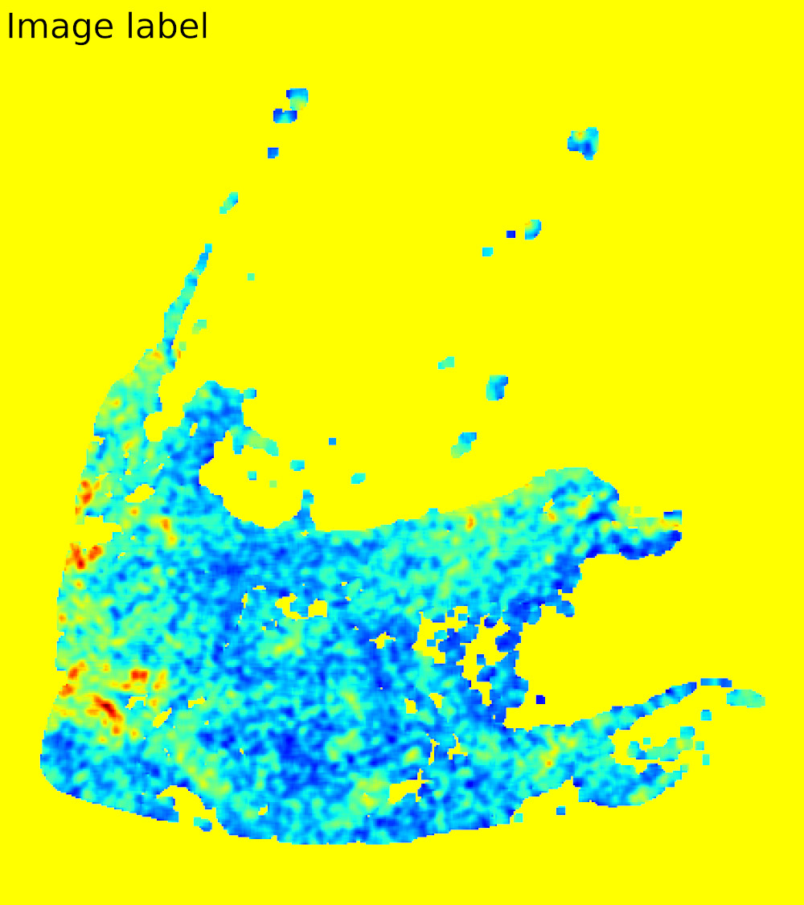

=======
Heatmap
=======

``dplabtools`` offers a dedicated heatmap class for visualizing WSI inference results performed by the ``WSIInference``
class.

``WSIHeatmap`` class features:

* Configurable color or transparency for image background.
* Configurable color map, data range, transparency for visualized data.
* Saving in different image formats, also with resolution information embedded.
* Saving as overlays with a cut-off point.
* Support for custom drawing functions for labels or watermarks added to saved images.

Basic usage
===========

Assuming that the variable ``inference`` represents a ``WSIInference`` object:

.. code-block:: python

        from dplabtools.slides.processing import WSIHeatmap

        heatmap = WSIHeatmap(heatmap_data=inference.classes_array[0])
        heatmap.save_png("heatmap1.png")

Output (heatmap1.png):

Class details
=============

.. autoclass:: dplabtools.slides.processing.WSIHeatmap(...)
   :class-doc-from: init
   :members:

.. note::

    Technically it is possible to feed any input data into the ``WSIHeatmap`` class. Such data needs to be a
    two-dimensional numpy array with one restriction: values representing background pixels i.e. pixels not processed
    by the model should be encoded as numpy ``nan`` (not a number) values.

.. warning::

    When generating heatmaps for a larger collection of images in one experiment, a data range should be specified
    (using ``vmin`` and ``vmax``). Otherwise the same color will represent different values for different images.

Examples
========

Custom drawing
==============

Custom drawing is implemented by passing two additional parameters (``draw_fn`` and ``draw_args``) to all image saving
functions, however the implementation details are not the same for each saving function. Assuming the variable
``inference`` represents a ``WSIInference`` object, the following example will add a custom label to the image saved
using ``save_png``:

.. code-block:: python

    from PIL import ImageFont
    from dplabtools.slides.processing import WSIHeatmap

    def draw_function(drawing_conext, *args):
        x, y, label, size = args
        font_path = "/tmp/DejaVuSans.ttf"
        font = ImageFont.truetype(font_path, size)
        drawing_conext.text((x, y), label, font=font, fill=(0,0,0))

    heatmap = WSIHeatmap(heatmap_data=inference.classes_array[0], alpha=1, background_color="yellow")
    heatmap.save_png("heatmap6.png", draw_fn=draw_function, draw_args=(50, 50, "Image label", 300))

Output:

