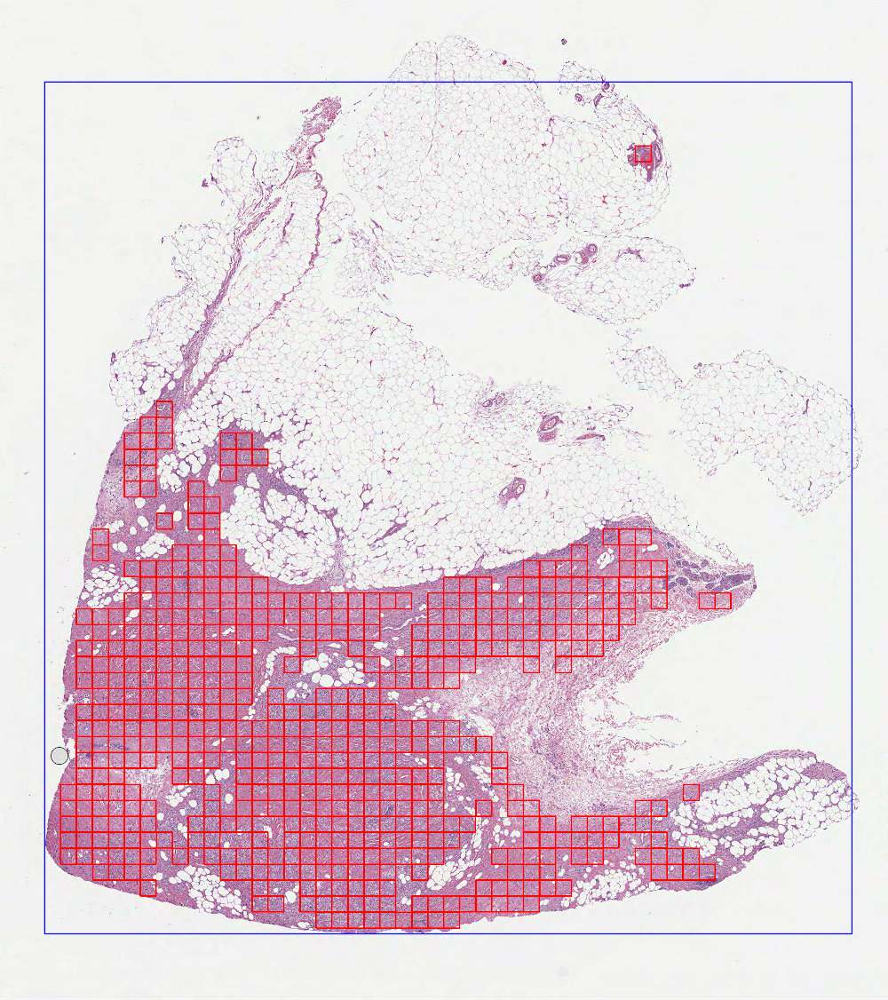
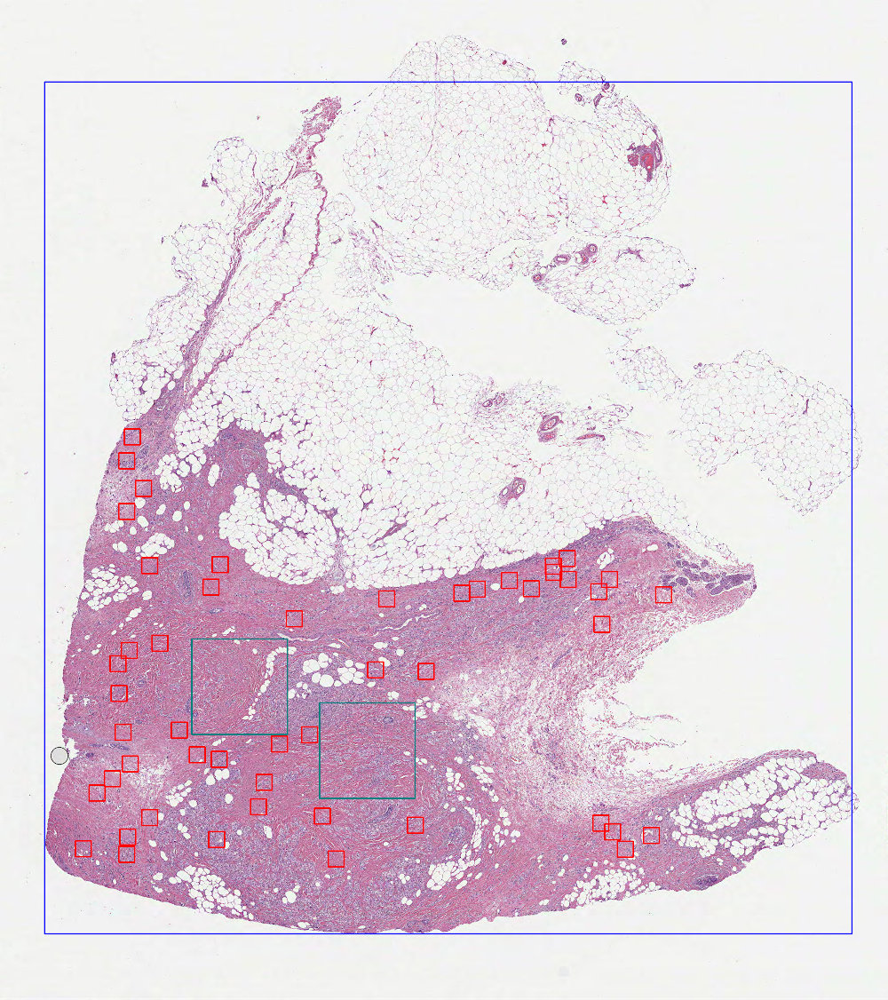
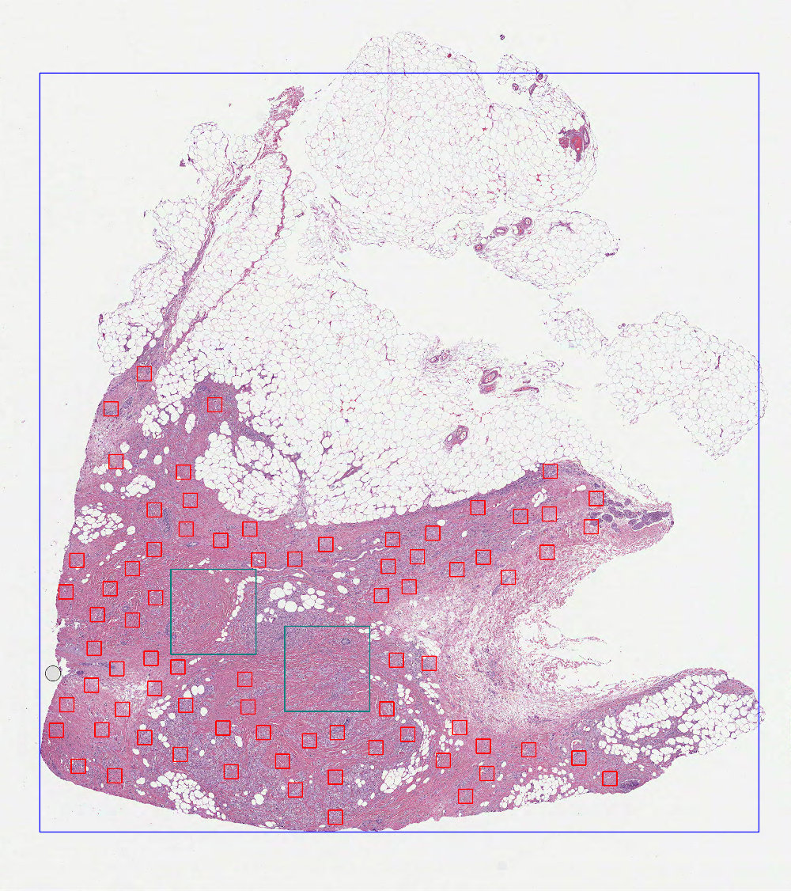
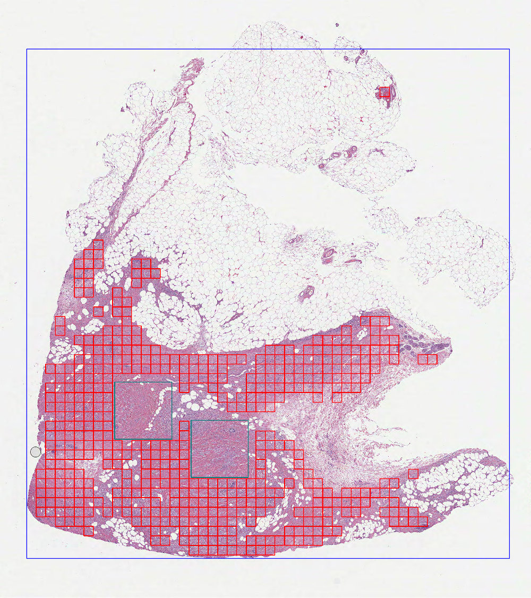
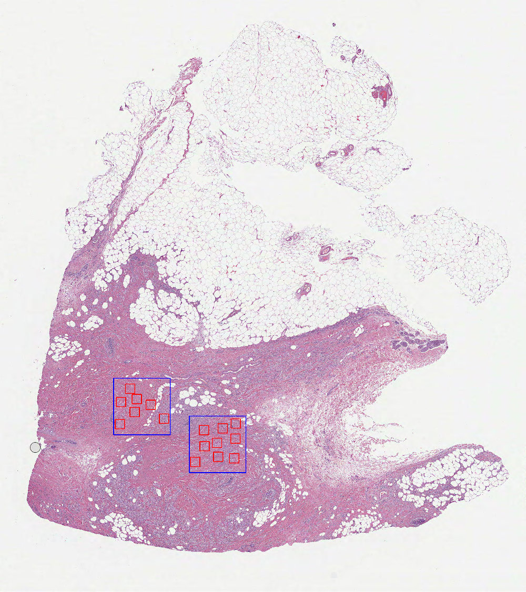
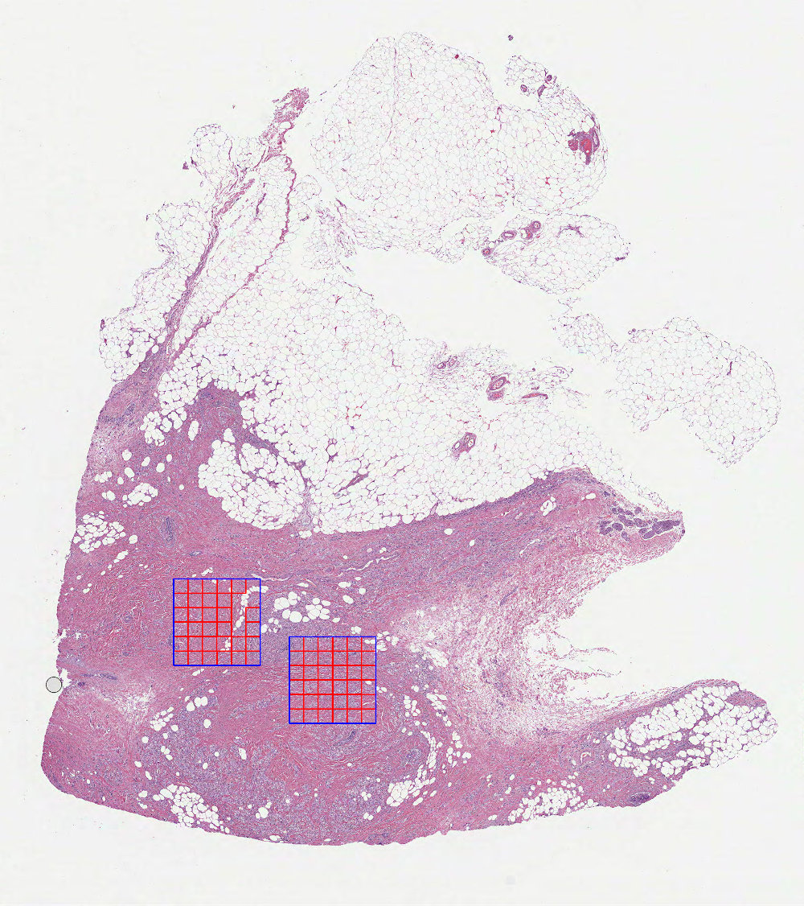
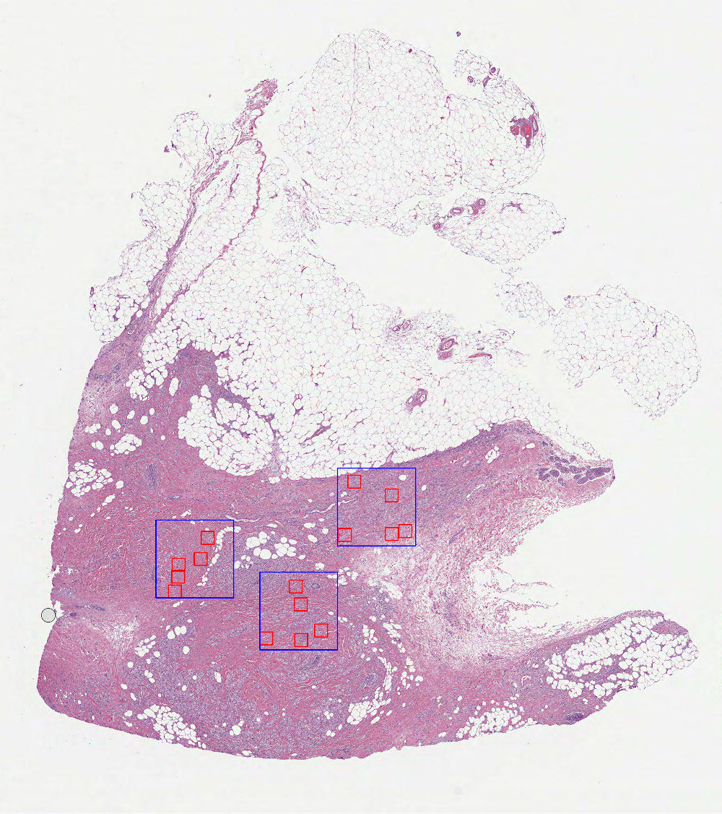
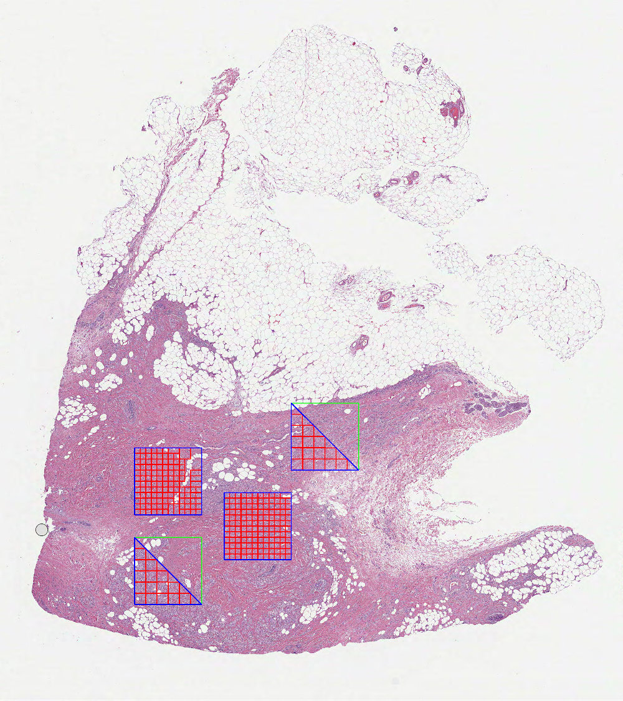
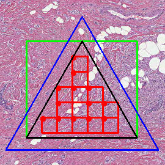

.. include:: colors.rst

========================
Patch locations/sampling
========================

``dplaptools`` provides a set of classes for calculating patch locations on whole images or inside and outside of
annotated regions represented by polygons.  Patch sampling methods include: random patches, grid patches and
Poisson disk patches. Additionally, using patch locations computed externally is also possible by utilizing classes
dedicated to custom patches.

Objects created from classes introduced below can be fed directly into :doc:`/slides/extractors`  classes for patch
extraction, or processed independently using embedded properties.

Other class features:

* Built-in counters with calculated patch information.
* Generating preview images with calculated patches.

Additional features for annotated WSIs:

* Configurable handling of embedded polygons.
* Built-in checks and warnings for overlapping polygons.
* Filtering polygons based on arbitrary label values.
* Ability to apply different processing parameters to polygons with different labels.

Random patches on whole images
==============================

.. autoclass:: dplabtools.slides.patches.WholeImageRandomPatches(...)
   :class-doc-from: class

Basic usage
-----------

.. code-block:: python

    from dplabtools.slides.patches import WholeImageRandomPatches

    wsi_file = "/tmp/wsi1.svs"
    mask_file = "/tmp/wsi1_mask.png"

    random_patches = WholeImageRandomPatches(
        wsi_file=wsi_file,
        mask_data=mask_file,
        patch_size=500,
        num_patches=20,
    )
    random_patches.save_preview_image("patches_image_random.jpg")

Output (patches_image_random.jpg):

Class details
-------------

Parameters specific to ``WholeImageRandomPatches``:

.. autoparam::
   :params: num_patches, weak_label
   :paths: dplabtools.slides.patches.locations.mixins.RandomMixin,
           dplabtools.slides.patches.locations.regions.WholeImagePatches

.. seealso::
    :ref:`patch-common-parameters-label`

.. seealso::
    :ref:`patch-common-methods-label`

Poisson disk patches on whole images
====================================

.. autoclass:: dplabtools.slides.patches.WholeImagePoissonDiskPatches(...)
   :class-doc-from: class

Basic usage
-----------

.. code-block::

    from dplabtools.slides.patches import WholeImagePoissonDiskPatches

    wsi_file = "/tmp/wsi1.svs"
    mask_file = "/tmp/wsi1_mask.png"

    poisson_patches = WholeImagePoissonDiskPatches(
        wsi_file=wsi_file,
        mask_data=mask_file,
        patch_size=500,
        poisson_spacing=60,
    )
    poisson_patches.save_preview_image("patches_image_poisson.jpg")

Output (patches_image_poisson.jpg)

Class details
-------------

Parameters specific to ``WholeImagePoissonDiskPatches``:

.. autoparam::
   :params: poisson_spacing, weak_label
   :paths: dplabtools.slides.patches.locations.mixins.PoissonDiskMixin,
           dplabtools.slides.patches.locations.regions.WholeImagePatches

.. seealso::
    :ref:`patch-common-parameters-label`

.. seealso::
    :ref:`patch-common-methods-label`

Grid based patches on whole images
==================================

.. autoclass:: dplabtools.slides.patches.WholeImageGridPatches(...)
   :class-doc-from: class

Basic usage
-----------

.. code-block:: python

    from dplabtools.slides.patches import WholeImageGridPatches

    wsi_file = "/tmp/wsi1.svs"
    mask_file = "/tmp/wsi1_mask.png"

    grid_patches = WholeImageGridPatches(
        wsi_file=wsi_file,
        mask_data=mask_file,
        patch_size=500,
        patch_stride=1,
    )
    grid_patches.save_preview_image("patches_image_grid.jpg")

Output (patches_image_grid.jpg):

Class details
-------------

Parameters specific to ``WholeImageGridPatches``:

.. autoparam::
   :params: patch_stride, weak_label
   :paths: dplabtools.slides.patches.locations.mixins.GridMixin,
           dplabtools.slides.patches.locations.regions.WholeImagePatches

.. seealso::
    :ref:`patch-common-parameters-label`

.. seealso::
    :ref:`patch-common-methods-label`

Inverted random patches on whole images
=======================================

.. autoclass:: dplabtools.slides.patches.WholeImageInvertedRandomPatches(...)
   :class-doc-from: class

Basic usage
-----------

.. code-block:: python

    from dplabtools.slides.patches import WholeImageInvertedRandomPatches
    from dplabtools.slides.utils import AnnotationPolygon

    wsi_file = "/tmp/wsi1.svs"
    mask_file = "/tmp/wsi1_mask.png"

    poly1 = AnnotationPolygon(
        points=[(10000, 22000), (10000, 25000), (13000, 25000), (13000, 22000)], label=""
    )
    poly2 = AnnotationPolygon(
        points=[(6000, 20000), (6000, 23000), (9000, 23000), (9000, 20000)], label=""
    )
    polygon_data = [poly1, poly2]

    random_patches = WholeImageInvertedRandomPatches(
        wsi_file=wsi_file,
        mask_data=mask_file,
        patch_size=500,
        num_patches=50,
        polygon_data=polygon_data,
    )
    random_patches.save_preview_image("patches_image_inverted_random.jpg")

Output (patches_image_inverted_random.jpg):

Class details
-------------

Parameters specific to ``WholeImageInvertedRandomPatches``:

.. autoparam::
   :params: num_patches, polygon_data, weak_label, included_labels, excluded_labels
   :paths: dplabtools.slides.patches.locations.mixins.RandomMixin,
           dplabtools.slides.patches.locations.regions.WholeImageInvertedPatches,
           dplabtools.slides.patches.locations.regions.WholeImageInvertedPatches,
           dplabtools.slides.patches.locations.regions.WholeImageInvertedPatches,
           dplabtools.slides.patches.locations.regions.WholeImageInvertedPatches,

.. seealso::
    :ref:`patch-common-parameters-label`

.. seealso::
    :ref:`patch-common-methods-label`

Inverted Poisson disk patches on whole images
=============================================

.. autoclass:: dplabtools.slides.patches.WholeImageInvertedPoissonDiskPatches(...)
   :class-doc-from: class

Basic usage
-----------

.. code-block:: python

    from dplabtools.slides.patches import WholeImageInvertedPoissonDiskPatches
    from dplabtools.slides.utils import AnnotationPolygon

    wsi_file = "/tmp/wsi1.svs"
    mask_file = "/tmp/wsi1_mask.png"

    poly1 = AnnotationPolygon(
        points=[(10000, 22000), (10000, 25000), (13000, 25000), (13000, 22000)], label=""
    )
    poly2 = AnnotationPolygon(
        points=[(6000, 20000), (6000, 23000), (9000, 23000), (9000, 20000)], label=""
    )
    polygon_data = [poly1, poly2]

    poisson_patches = WholeImageInvertedPoissonDiskPatches(
        wsi_file=wsi_file,
        mask_data=mask_file,
        patch_size=500,
        poisson_spacing=60,
        polygon_data=polygon_data,
    )
    poisson_patches.save_preview_image("patches_image_inverted_poisson.jpg")

Output (patches_image_inverted_poisson.jpg):

Class details
-------------

Parameters specific to ``WholeImageInvertedPoissonDiskPatches``:

.. autoparam::
   :params: poisson_spacing, polygon_data, weak_label, included_labels, excluded_labels
   :paths: dplabtools.slides.patches.locations.mixins.PoissonDiskMixin,
           dplabtools.slides.patches.locations.regions.WholeImageInvertedPatches,
           dplabtools.slides.patches.locations.regions.WholeImageInvertedPatches,
           dplabtools.slides.patches.locations.regions.WholeImageInvertedPatches,
           dplabtools.slides.patches.locations.regions.WholeImageInvertedPatches,

.. seealso::
    :ref:`patch-common-parameters-label`

.. seealso::
    :ref:`patch-common-methods-label`

Inverted grid based patches on whole images
===========================================

.. autoclass:: dplabtools.slides.patches.WholeImageInvertedGridPatches(...)
   :class-doc-from: class

Basic usage
-----------

.. code-block:: python

    from dplabtools.slides.patches import WholeImageInvertedGridPatches
    from dplabtools.slides.utils import AnnotationPolygon

    wsi_file = "/tmp/wsi1.svs"
    mask_file = "/tmp/wsi1_mask.png"

    poly1 = AnnotationPolygon(
        points=[(10000, 22000), (10000, 25000), (13000, 25000), (13000, 22000)], label=""
    )
    poly2 = AnnotationPolygon(
        points=[(6000, 20000), (6000, 23000), (9000, 23000), (9000, 20000)], label=""
    )
    polygon_data = [poly1, poly2]

    grid_patches = WholeImageInvertedGridPatches(
        wsi_file=wsi_file,
        mask_data=mask_file,
        patch_size=500,
        patch_stride=1,
        polygon_data=polygon_data,
    )
    grid_patches.save_preview_image("patches_image_inverted_grid.jpg")

Output (patches_image_inverted_grid.jpg):

Class details
-------------

Parameters specific to ``WholeImageInvertedGridPatches``:

.. autoparam::
   :params: patch_stride, polygon_data, weak_label, included_labels, excluded_labels
   :paths: dplabtools.slides.patches.locations.mixins.GridMixin,
           dplabtools.slides.patches.locations.regions.WholeImageInvertedPatches,
           dplabtools.slides.patches.locations.regions.WholeImageInvertedPatches,
           dplabtools.slides.patches.locations.regions.WholeImageInvertedPatches,
           dplabtools.slides.patches.locations.regions.WholeImageInvertedPatches,

.. seealso::
    :ref:`patch-common-parameters-label`

.. seealso::
    :ref:`patch-common-methods-label`

Random patches on polygon regions
=================================

.. autoclass:: dplabtools.slides.patches.PolygonRegionRandomPatches(...)
   :class-doc-from: class

Basic usage
-----------

.. code-block:: python

    from dplabtools.slides.patches import PolygonRegionRandomPatches
    from dplabtools.slides.utils import AnnotationPolygon

    wsi_file = "/tmp/wsi1.svs"
    mask_file = "/tmp/wsi1_mask.png"

    poly1 = AnnotationPolygon(
        points=[(10000, 22000), (10000, 25000), (13000, 25000), (13000, 22000)], label=""
    )
    poly2 = AnnotationPolygon(
        points=[(6000, 20000), (6000, 23000), (9000, 23000), (9000, 20000)], label=""
    )
    polygon_data = [poly1, poly2]

    random_patches = PolygonRegionRandomPatches(
        wsi_file=wsi_file,
        mask_data=mask_file,
        patch_size=500,
        num_patches=10,
        polygon_data=polygon_data,
    )
    random_patches.save_preview_image("patches_polygons_random.jpg")

Output (patches_polygons_random.jpg):

Class details
-------------

Parameters specific to ``PolygonRegionRandomPatches``:

.. autoparam::
   :params: num_patches, polygon_data, check_polygons, included_labels, excluded_labels
   :paths: dplabtools.slides.patches.locations.mixins.RandomMixin,
           dplabtools.slides.patches.locations.regions.PolygonRegionPatches,
           dplabtools.slides.patches.locations.regions.PolygonRegionPatches,
           dplabtools.slides.patches.locations.regions.PolygonRegionPatches,
           dplabtools.slides.patches.locations.regions.PolygonRegionPatches,

.. note::
    In this class parameter ``num_patches`` denotes the number of patches per one polygon region. This behavior
    can be changed using :ref:`patch-expandable-parameters-label`.

.. seealso::
    :ref:`patch-check-polygons-label`

.. seealso::
    :ref:`patch-common-parameters-label`

.. seealso::
    :ref:`patch-common-methods-label`

.. seealso::
    :ref:`patch-expandable-parameters-label`

Poisson disk patches on polygon regions
=======================================

.. autoclass:: dplabtools.slides.patches.PolygonRegionPoissonDiskPatches(...)
   :class-doc-from: class

Basic usage
-----------

.. code-block:: python

    from dplabtools.slides.patches import PolygonRegionPoissonDiskPatches
    from dplabtools.slides.utils import AnnotationPolygon

    wsi_file = "/tmp/wsi1.svs"
    mask_file = "/tmp/wsi1_mask.png"

    poly1 = AnnotationPolygon(
        points=[(10000, 22000), (10000, 25000), (13000, 25000), (13000, 22000)], label=""
    )
    poly2 = AnnotationPolygon(
        points=[(6000, 20000), (6000, 23000), (9000, 23000), (9000, 20000)], label=""
    )
    polygon_data = [poly1, poly2]

    poisson_patches = PolygonRegionPoissonDiskPatches(
        wsi_file=wsi_file,
        mask_data=mask_file,
        patch_size=500,
        poisson_spacing=40,
        polygon_data=polygon_data,
    )
    poisson_patches.save_preview_image("patches_polygons_poisson.jpg")

Output (patches_polygons_poisson.jpg):

Class details
-------------

Parameters specific to ``PolygonRegionPoissonDiskPatches``:

.. autoparam::
   :params: poisson_spacing, polygon_data, check_polygons, included_labels, excluded_labels
   :paths: dplabtools.slides.patches.locations.mixins.PoissonDiskMixin,
           dplabtools.slides.patches.locations.regions.PolygonRegionPatches,
           dplabtools.slides.patches.locations.regions.PolygonRegionPatches,
           dplabtools.slides.patches.locations.regions.PolygonRegionPatches,
           dplabtools.slides.patches.locations.regions.PolygonRegionPatches,

.. seealso::
    :ref:`patch-check-polygons-label`

.. seealso::
    :ref:`patch-common-parameters-label`

.. seealso::
    :ref:`patch-common-methods-label`

.. seealso::
    :ref:`patch-expandable-parameters-label`

Grid based patches on polygon regions
=====================================

.. autoclass:: dplabtools.slides.patches.PolygonRegionGridPatches(...)
   :class-doc-from: class

Basic usage
-----------

.. code-block:: python

    from dplabtools.slides.patches import PolygonRegionGridPatches
    from dplabtools.slides.utils import AnnotationPolygon

    wsi_file = "/tmp/wsi1.svs"
    mask_file = "/tmp/wsi1_mask.png"

    poly1 = AnnotationPolygon(
        points=[(10000, 22000), (10000, 25000), (13000, 25000), (13000, 22000)], label=""
    )
    poly2 = AnnotationPolygon(
        points=[(6000, 20000), (6000, 23000), (9000, 23000), (9000, 20000)], label=""
    )
    polygon_data = [poly1, poly2]

    grid_patches = PolygonRegionGridPatches(
        wsi_file=wsi_file,
        mask_data=mask_file,
        patch_size=500,
        patch_stride=1,
        polygon_data=polygon_data,
    )
    grid_patches.save_preview_image("patches_polygons_grid.jpg")

Output (patches_polygons_grid.jpg):

Class details
-------------

Parameters specific to ``PolygonRegionGridPatches``:

.. autoparam::
   :params: patch_stride, polygon_data, check_polygons, included_labels, excluded_labels
   :paths: dplabtools.slides.patches.locations.mixins.GridMixin,
           dplabtools.slides.patches.locations.regions.PolygonRegionPatches,
           dplabtools.slides.patches.locations.regions.PolygonRegionPatches,
           dplabtools.slides.patches.locations.regions.PolygonRegionPatches,
           dplabtools.slides.patches.locations.regions.PolygonRegionPatches,

.. seealso::
    :ref:`patch-check-polygons-label`

.. seealso::
    :ref:`patch-common-parameters-label`

.. seealso::
    :ref:`patch-common-methods-label`

.. seealso::
    :ref:`patch-expandable-parameters-label`

Custom patches
==============

The following classes allow the user to feed and process patch locations computed externally:

* .. autoclass:: dplabtools.slides.patches.WholeImageCustomPatches(...)
     :class-doc-from: class
* .. autoclass:: dplabtools.slides.patches.WholeImageInvertedCustomPatches(...)
     :class-doc-from: class
* .. autoclass:: dplabtools.slides.patches.PolygonRegionCustomPatches(...)
     :class-doc-from: class

Example
-------

.. code-block:: python

    from dplabtools.slides.patches import WholeImageCustomPatches

    wsi_file = "/tmp/wsi1.svs"
    mask_file = "/tmp/wsi1_mask.png"
    points = [(3000, 3000), (4000, 4000), (5000, 5000), (6000, 6000)]

    custom_patches = WholeImageCustomPatches(
        wsi_file=wsi_file,
        mask_data=mask_file,
        patch_size=500,
        points=points,
    )

Class details
-------------

Parameters specific to all `custom patches` classes:

.. autoparam::
   :params: points
   :paths: dplabtools.slides.patches.locations.mixins.CustomPointsMixin,

.. note::
    It is worth noting that ``points`` provided by the user represent candidate patches, not the final patches.
    Each point must satisfy other relevant criteria (``foreground_ratio``, ``overlap_ratio``, etc.) to be considered
    a valid (final) patch.

.. seealso::
    :ref:`patch-common-parameters-label`

.. seealso::
    :ref:`patch-common-methods-label`

.. _patch-common-parameters-label:

Parameters common in all patch classes
======================================

.. index:: Parameters common in all patch classes

.. autoparam::
   :params: wsi_file, mask_data, patch_size, level_or_mpp, foreground_ratio, overlap_ratio, polygon_buffer
   :paths: dplabtools.slides.patches.locations.base.BasePatches,
           dplabtools.slides.patches.locations.base.BasePatches,
           dplabtools.slides.patches.locations.base.BasePatches,
           dplabtools.slides.patches.locations.base.BasePatches,
           dplabtools.slides.patches.locations.base.BasePatches,
           dplabtools.slides.patches.locations.base.BasePatches,
           dplabtools.slides.patches.locations.base.BasePatches

.. seealso::
    :ref:`special-level-or-mpp-label`

.. seealso::
    :ref:`patch-parameters-details-label`

.. seealso::
    :ref:`patch-expandable-parameters-label`

.. _patch-common-methods-label:

Methods and properties common to all patch classes
==================================================

.. index:: Methods and properties common to all patch classes

Common methods and properties are derived from the base class.

.. autoclass:: dplabtools.slides.patches.locations.base.BasePatches(...)
   :class-doc-from: class
   :members:
   :inherited-members:

.. seealso::
    :ref:`special-level-or-minsize-label`

.. seealso::
    :ref:`patch-preview-image-label`

.. _patch-check-polygons-label:

"check_polygons" explained
==========================

Parameter ``check_polygons`` controls how overlapping and contained (embedded) polygons are handled.

* Case 1 (``check_polygons=False``)

 In this mode each polygon is treated as an independent entity, which will cause certain regions to be sampled more than
 once:

    .. image:: images/patches_polygons_check_false.jpg
       :height: 300
       :alt: Check polygons false

* Case 2 (``check_polygons=True`` - default value)

 In this mode mutual relationships between polygons are taken into account and polygon transformations are applied to
 prevent embedded regions from being sampled more than once:

    .. image:: images/patches_polygons_check_true.jpg
       :height: 300
       :alt: Check polygons true

 Additionally, in this mode a warning message will be logged in case of partially overlapping polygons found:

 ``wsi1.svs: Polygon 1 overlaps with polygon 2, overlapping area: 33.428571 patches``

.. _patch-parameters-details-label:

Parameters details
==================

* ``mask_data``

 WSI mask represented by an image file, numpy array file, or a numpy memory object. The dimensions of the mask should
 match one of the WSI levels.

* ``patch_size``

 Patches are calculated as squares with dimensions ``patch_size`` x ``patch_size``.

* ``level_or_mpp``

 Provided `int` number will be interpreted as a WSI level, while `float` value will be interpreted as an MPP value.

* ``foreground_ratio``

 Minimum percentage of foreground tissue to be present in calculated patches (based on the ``mask_data``).
 The higher the ``foreground_ratio`` value, the more tissue-only area will be covered by calculated
 patches. Comparison of three different ``foreground_ratio`` values (0.5, 0.8, 0.95):

    .. image:: images/patches_foreground_ratio.jpg
       :width: 500
       :alt: Foreground ratio

* ``overlap_ratio``

 Minimum percentage of overlapping between calculated patches and the image or polygon region. The higher the
 ``overlap_ratio`` value, the more "contained" calculated patches will become. Comparison of three different
 ``overlap_ratio`` values (0.1, 0.5, 0.95):

    .. image:: images/patches_overlap_ratio.jpg
       :width: 500
       :alt: Overlap ratio

* ``polygon_buffer``

 Non-zero value will either increase (positive ``polygon_buffer`` value) or decrease (negative ``polygon_buffer`` value)
 the area of the image or polygon region, thus changing the number of calculated patches. Comparison of three different
 ``polygon_buffer`` values (0, 30, -30):

    .. image:: images/patches_polygon_buffer.jpg
       :width: 500
       :alt: Polygon buffer

.. _patch-expandable-parameters-label:

Expandable parameters
=====================

The following list defines so called "expandable parameters", which means they can accept either a single value or a
list of values:

* ``num_patches``
* ``patch_stride``
* ``poisson_spacing``
* ``foreground_ratio``
* ``overlap_ratio``
* ``polygon_buffer``

This behavior is possible when using one of the polygon based classes:

* ``PolygonRegionRandomPatches``
* ``PolygonRegionPoissonDiskPatches``
* ``PolygonRegionGridPatches``

and the size (`len`) of the expanded list should match the number of polygons present. Expanded parameters will be
applied to corresponding polygons based on their position in the list.

Example 1 (``num_patches=5`` i.e. parameter is not expanded):

.. code-block:: python

    from dplabtools.slides.patches import PolygonRegionRandomPatches
    from dplabtools.slides.utils import AnnotationPolygon

    wsi_file = "/tmp/wsi1.svs"
    mask_file = "/tmp/wsi1_mask.png"

    poly1 = AnnotationPolygon(
        points=[(10000, 22000), (10000, 25000), (13000, 25000), (13000, 22000)], label="poly"
    )
    poly2 = AnnotationPolygon(
        points=[(6000, 20000), (6000, 23000), (9000, 23000), (9000, 20000)], label="poly"
    )
    poly3 = AnnotationPolygon(
        points=[(13000, 18000), (13000, 21000), (16000, 21000), (16000, 18000)], label="poly"
    )
    polygon_data = [poly1, poly2, poly3]

    random_patches = PolygonRegionRandomPatches(
        wsi_file=wsi_file,
        mask_data=mask_file,
        patch_size=500,
        num_patches=5,
        polygon_data=polygon_data,
    )
    random_patches.save_preview_image("patches_polygons_not_expanded.jpg")

Output (patches_polygons_not_expanded.jpg):

Example 2 (``num_patches=[1, 2, 3]`` i.e. parameter is expanded):

.. code-block:: python

    from dplabtools.slides.patches import PolygonRegionRandomPatches
    from dplabtools.slides.utils import AnnotationPolygon

    wsi_file = "/tmp/wsi1.svs"
    mask_file = "/tmp/wsi1_mask.png"

    poly1 = AnnotationPolygon(
        points=[(10000, 22000), (10000, 25000), (13000, 25000), (13000, 22000)], label="poly"
    )
    poly2 = AnnotationPolygon(
        points=[(6000, 20000), (6000, 23000), (9000, 23000), (9000, 20000)], label="poly"
    )
    poly3 = AnnotationPolygon(
        points=[(13000, 18000), (13000, 21000), (16000, 21000), (16000, 18000)], label="poly"
    )
    polygon_data = [poly1, poly2, poly3]

    random_patches = PolygonRegionRandomPatches(
        wsi_file=wsi_file,
        mask_data=mask_file,
        patch_size=500,
        num_patches=[1, 2, 3],
        polygon_data=polygon_data,
    )
    random_patches.save_preview_image("patches_polygons_expanded.jpg")

Output (patches_polygons_expanded.jpg):

The same principle applies to all expandable parameters. Using a simple utility function it is possible to automatically
differentiate between different polygon labels, as in the example below.

Example 3 (different ``patch_stride`` values applied to different polygon labels):

.. code-block:: python

    from dplabtools.slides.patches import PolygonRegionGridPatches
    from dplabtools.slides.utils import AnnotationPolygon

    wsi_file = "/tmp/wsi1.svs"
    mask_file = "/tmp/wsi1_mask.png"

    poly1 = AnnotationPolygon(
        points=[(10000, 22000), (10000, 25000), (13000, 25000), (13000, 22000)], label="rect"
    )
    poly2 = AnnotationPolygon(
        points=[(6000, 20000), (6000, 23000), (9000, 23000), (9000, 20000)], label="rect"
    )
    poly3 = AnnotationPolygon(
        points=[(13000, 18000), (13000, 21000), (16000, 21000)], label="triangle"
    )
    poly4 = AnnotationPolygon(
        points=[(6000, 24000), (6000, 27000), (9000, 27000)], label="triangle"
    )
    polygon_data = [poly1, poly2, poly3, poly4]

    def get_stride_list(polygons, rect_stride=0.5, triangle_stride=1):
        return [rect_stride if poly.label == "rect" else triangle_stride for poly in polygons]

    grid_patches = PolygonRegionGridPatches(
        wsi_file=wsi_file,
        mask_data=mask_file,
        patch_size=500,
        patch_stride=get_stride_list(polygons),
        polygon_data=polygon_data,
    )
    grid_patches.save_preview_image("patches_polygons_expanded_stride.jpg")

Output (patches_polygons_expanded_stride.jpg):

.. _patch-preview-image-label:

Preview image
=============

By calling ``save_preview_image`` calculated patches can be visualized and saved as a WSI overlay. The following
elements are included in the preview images, the order they are listed in indicates the drawing order, as some elements
may overlap and not be seen in each image:

* Calculated patches and optionally patch markers - :red:`red`.
* Bounding boxes for polygons or polygon buffers - :lime:`lime`.
* Polygons or one polygon representing the whole image - :blue:`blue`.
* Polygon holes (used in inverted patch classes) - :teal:`teal`.
* Polygon buffers - :black:`black`.

Additional notes:

* Patch markers are represented by small red circles placed in top left corner of each calculated patch.
* Each drawn element can be turned off individually by setting its color value to ``None``.
* Both ``drawn_labels`` and ``drawn_patches_labels`` provide label level filtering of the drawn content, however
  the former parameter takes precedence over the latter.
* ``level_or_minsize`` controls the dimensions of the saved image, if not specified then the image dimensions will
  match the dimensions of the provided mask.

