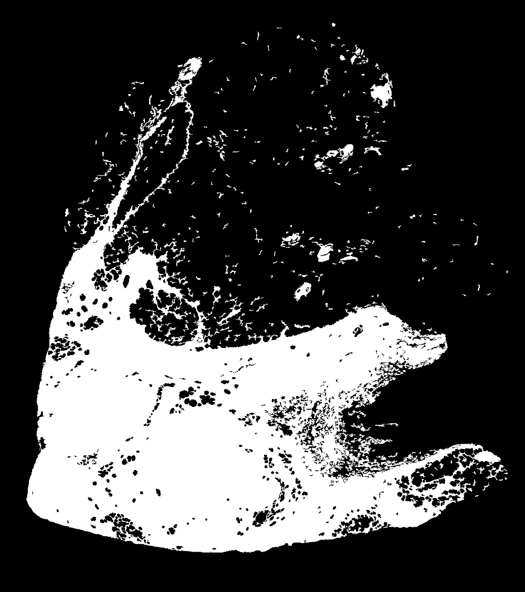
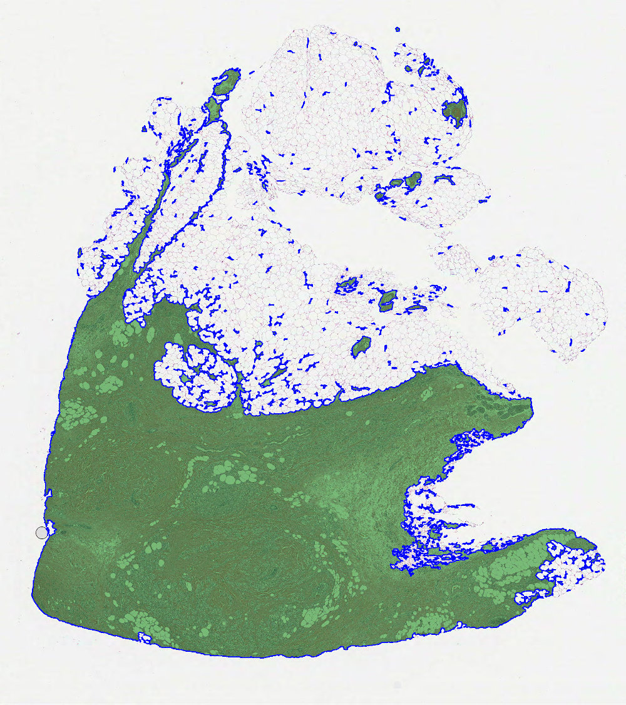
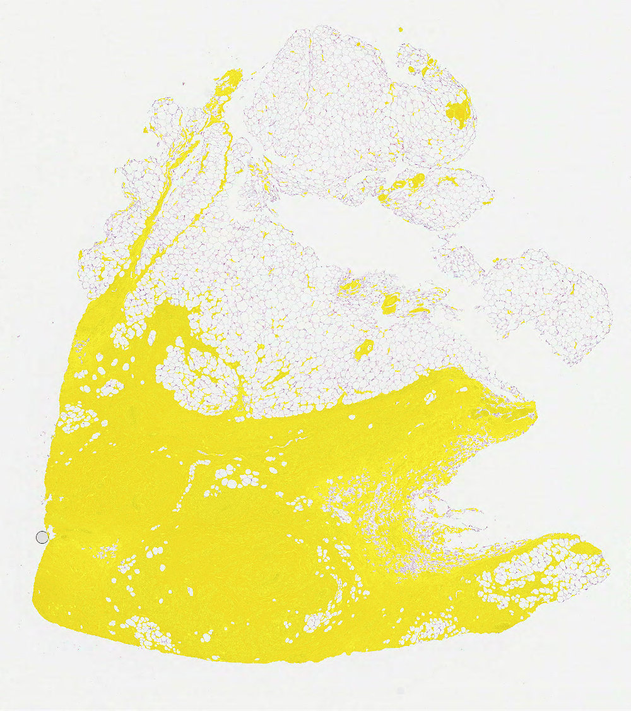

=====
Masks
=====

Masks are used to differentiate between foreground and background in WSI processing. ``dplabtools``
provides two classes for mask generation, based on either a set of polygons or tissue processing.

Additional features:

* Masks can be created at different WSI levels which determine their XY dimensions. Larger masks may capture more image
  details, but at the same time may reduce the downstream processing performance.
* Generated masks can be used as in-memory objects or saved to files as either images or NumPy arrays.
* In-memory mask objects are optimized for the smallest possible footprint.
* Saved mask files are optimized for the smallest possible file size.

Polygon based mask
==================

.. autoclass:: dplabtools.slides.processing.WSIPolygonMask(...)
   :class-doc-from: class

Notes:

* For convenience polygons are represented by :ref:`special-annotation-polygon-label` objects.
* Mask WSI level (determined by ``level_or_minsize``) should match the level at which polygons/annotations were created,
  typically level 0.

Basic usage
-----------

.. code-block:: python

    from dplabtools.slides.processing import WSIPolygonMask
    from dplabtools.slides.utils import AnnotationPolygon

    wsi_file = "/tmp/wsi1.svs"
    poly1 = AnnotationPolygon(points=[(2000, 2000), (2000, 3000), (3000, 3000), (3000, 2000)], label="")
    poly2 = AnnotationPolygon(points=[(2000, 4000), (2000, 5000), (3000, 5000), (3000, 4000)], label="")
    poly3 = AnnotationPolygon(points=[(4000, 2500), (5000, 3500), (4000, 4500)], label="")
    polygons = [poly1, poly2, poly3]
    mask = WSIPolygonMask(wsi_file=wsi_file, level_or_minsize=2, polygons=polygons)
    mask.save_png("mask_polygon.png")

Output (mask_polygon.png):

Class details
-------------

Parameters specific to ``WSIPolygonMask``:

.. autoparam::
   :params: polygons
   :paths: dplabtools.slides.processing.mask.polygon.WSIPolygonMask

.. seealso::
    :ref:`mask-common-parameters-label`

.. seealso::
    :ref:`mask-common-methods-label`

Tissue based mask
=================

.. autoclass:: dplabtools.slides.processing.WSITissueMask(...)
   :class-doc-from: class

Notes:

* 3 different processing modes are available: ``hsv``, ``lab``, ``otsu``.
* Masks can be created at any WSI level based on parameter ``level_or_minsize``.
* Mask quality can be improved by removing holes and small objects.

Basic usage
-----------

.. code-block:: python

    from dplabtools.slides.processing import WSITissueMask

    wsi_file = "/tmp/wsi1.svs"
    mask = WSITissueMask(wsi_file=wsi_file, level_or_minsize=2)
    mask.save_png("mask_tissue.png")

Output (mask_tissue.png):

Class details
-------------

Parameters specific to ``WSITissueMask``:

.. autoparam::
   :params: mode, color_threshold, remove_small_holes_ratio, remove_small_objects_ratio, remove_all_holes,
            close_fill_kernel_size
   :paths: dplabtools.slides.processing.mask.tissue.WSITissueMask,
           dplabtools.slides.processing.mask.tissue.WSITissueMask,
           dplabtools.slides.processing.mask.tissue.WSITissueMask,
           dplabtools.slides.processing.mask.tissue.WSITissueMask,
           dplabtools.slides.processing.mask.tissue.WSITissueMask,
           dplabtools.slides.processing.mask.tissue.WSITissueMask

.. seealso::
    :ref:`mask-common-parameters-label`

.. seealso::
    :ref:`mask-common-methods-label`

Parameter details
-----------------

* ``mode`` and ``color_threshold``

 ``hsv`` and ``lab`` modes use different color space during processing and are accompanied by a ``color_threshold`` value,
 their optimal values vary between different tissue staining techniques and should be determined experimentally.

 ``otsu`` mode uses Otsu algorithm to find the optimal threshold value and ignores the ``color_threshold`` parameter.

 Comparison of all three mask ``mode`` values (``hsv``, ``lab`` and ``otsu``) with the same threshold value:

    .. image:: images/mask_modes.png
       :height: 200
       :alt: Tissue mask modes

* ``remove_small_holes_ratio``

 If greater than zero, enables removing small holes in the generated mask. Its numerical value represents the ratio of a
 256x256 patch, whose total pixel count represents the maximum size of removed holes. E.g. ``remove_small_holes_ratio=0.5``
 indicates that holes up to 32768 pixels (256x256*0.5) should be removed, when using ``level_or_minsize=0``.
 When using a different ``level_or_minsize`` values, the pixel count value will be scaled down accordingly, e.g. for values
 ``remove_small_holes_ratio=0.5`` and ``level_or_minsize=1`` holes up to  8192 pixels (32768/4) will be removed
 (`4` being the downsample factor between levels 0 and 1).

 Comparison of three ``remove_small_holes_ratio`` values (0.1, 0.5, 1.0):

    .. image:: images/mask_small_holes.png
       :height: 200
       :alt: Tissue mask remove small holes

* ``remove_small_objects_ratio``

 Same logic as ``remove_small_holes_ratio``, except it removes small objects in the generated mask.

 Comparison of three ``remove_small_objects_ratio`` values (0.1, 0.5, 1.0):

    .. image:: images/mask_small_objects.png
       :height: 200
       :alt: Tissue mask remove small objects

 .. hint::

    Removing small objects will accelerate many downstream tasks, as the mask processing area will be more confined
    and thus making the process of scanning the mask complete faster.

* ``remove_all_holes``

 When `True`, this will remove all holes in the generated mask, any value set in ``remove_small_holes_ratio`` will
 be disregarded, an example:

    .. image:: images/mask_all_holes.png
       :height: 200
       :alt: Tissue mask remove all holes

* ``close_fill_kernel_size``

 This parameter controls the kernel size that is used to close and fill the gaps, an alternative method of
 smoothing the generated mask.

 Comparison of four ``close_fill_kernel_size`` values (0, 5, 10, 15):

    .. image:: images/mask_kernels.png
       :height: 200
       :alt: Tissue mask different kernels

.. _mask-common-parameters-label:

Parameters common in all mask classes
=====================================

.. autoparam::
   :params: wsi_file, level_or_minsize
   :paths: dplabtools.slides.processing.mask.base.BaseMask, dplabtools.slides.processing.mask.base.BaseMask

.. seealso::
    :ref:`special-level-or-minsize-label`

.. _mask-common-methods-label:

Methods and properties common to all mask classes
=================================================

.. index:: Methods and properties common to mask classes

Common methods and properties are derived from the base class.

.. autoclass:: dplabtools.slides.processing.mask.base.BaseMask(...)
   :class-doc-from: class
   :members:
   :inherited-members:

Mask overlay examples
=====================

